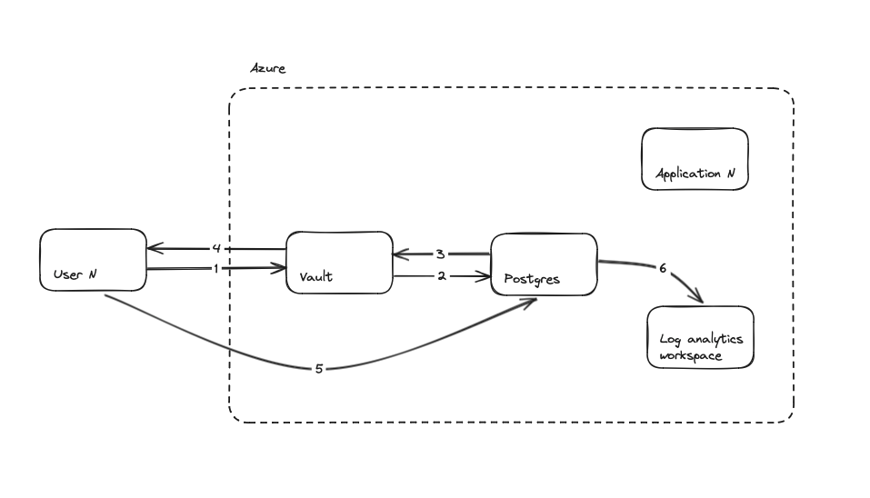

# silver-adventure
As the auto-generated name suggests, it was certainly an adventure. Not completed to the (gold) standard I had hoped, but a fun task and good learning experience overall.

# 1. Deployable Production Environment

## Tools used

#### Azure and Terraform
Why? A great opportunity to work with new technologies.

#### Docker
Why? Because a 'podman X buildah' setup is not available on MacOS, so would not be easily repeatable by the audience.

#### Shell scripts...
Why? Quick and easy way to get started grouping CLI commands.

## Local setup and automation

This repository consists of a collection of shell scripts designed to be run one after another on MacOS at the root of the repository.

The process assumes only that the user is running on MacOS and has an active Azure subscription (free tier is fine).

Execute the scripts in order, noting the commands used to run vary between `source` and `sh`:

### 1. `setup-shell.sh`

#### Steps
- Install required tools
- Login to Azure
- Create a service principal
- Configure service principal credentials in shell environment variables

#### Command:

```bash
source setup-shell.sh
```

### 2. `create-container-registry.sh`

#### Steps
- Uses Terraform to create a resource group and container registry
- Creates a new service principal with push permission to the registry
- Configure this service principal credentials in different shell environment variables

#### Command:

```bash
source create-container-registry.sh
```

### 3. `docker-build-and-push.sh`

#### Steps
- Starts Docker desktop
- Sleeps whilst Docker desktop starts
- Logs into the container registry with generated credentials
- Builds and pushes a container image to the registry

#### Command:

```bash
sh docker-build-and-push.sh
```

### 4. `create-container-app.sh`

#### Steps
- Registers container app provider 
- Grants Terraform service principal permission to pull images from the created registry
- Logs into the container registry with pull permission credentials
- Uses Terraform to create a container app

#### Command:

```bash
sh create-container-app.sh
```

# 2. Secure Database Access

Summary of solution requirements:
- Rotates DB user passwords
- DB access by users and applications
- Manual approval for new DB users
- E2E audit capability for DB operations
- Zero downtime

### Proposed solution:

#### HashiCorp Vault Database Secrets Engine
Deploying a Vault Production cluster (highly available) to handle the rotation and creation of database users and credentials would ensure zero downtime. Here is an example of how it might be set up:

- Enable the appropriate auth methods to allow users from other cloud platforms and systems to authenticate
- Enable the Database Secrets Engine and provide Vault with the Postgres root admin password. Vault will automatically rotate the root password based on a specified time period.
- Create roles such as readonly, readwrite etc. based on the groups of necessary database actions which would be performed by individual users / applications
- A way of adding manual approval by data security personel is by mapping a 'group' entity from an auth method, to a one of these Vault roles. For example, if using Active Directory, an AD group could be created, and joining the AD group can be manually controlled.
- Each time an application or user with a valid role requests database credentials, the secrets engine generates and returns them (created on request) with a TTL.

Vault would provide the audit information about who is granted database credentials, but no visibility of what operations are performed. For this audit capability, [pgAudit](https://www.pgaudit.org) could be used, with logging configured to use Azure Monitor Logs for analytics and performance.

#### Diagram



1. User requests database credentials from Vault
2. Vault uses database root credentials to create a temporary database user with role defined by external group
3. Database returns generated credentials to Vault
4. Vault returns generated credentials to User
5. User uses credentials to log in to database and perform operations
6. Monitor logs collects logs from pgAudit in a Log Analytics Workspace ready for analysis

Note the interaction would be the same for a User or an Application using a service principal.