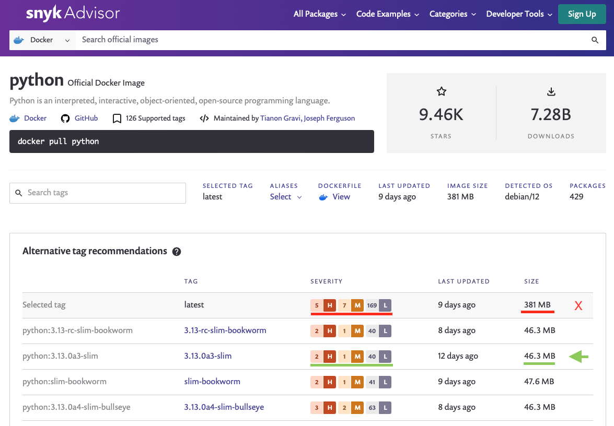

# Building Dockerfiles
Information sourced from [this Snyk blog](https://snyk.io/blog/best-practices-containerizing-python-docker/)

For a solution using two containers, first find base images with minimal vulnerabilities.

Snyk advisor presents base images with fewer vulnerabilities and smaller sizes to reduce the chance of vulnerabilities:

